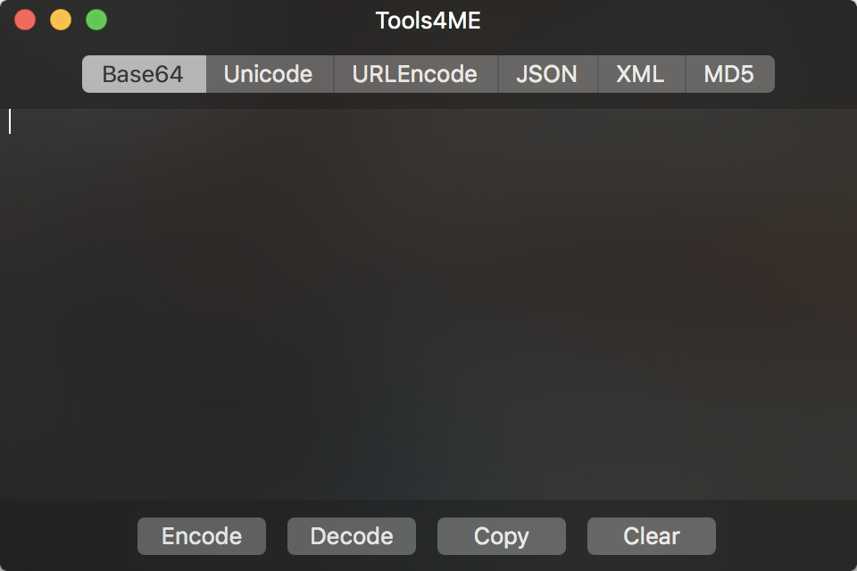

# Tools4ME-macOS
Tools4ME macOS Version, Support macOS 10.11+ Based on Swift!

## Features

* Base64 Encode/Decode
* Unicode Encode/Decode
* JSON Compact/Pretty
* XML Compact/Pretty
* MD5 Encrypt
* Support Zoom By 2 Fingers

## TODO

* [ ] Random String Generator
* [ ] UUID Generator
* [ ] QR Generator & Reader
* [ ] And More U Need...

## Screenshort

